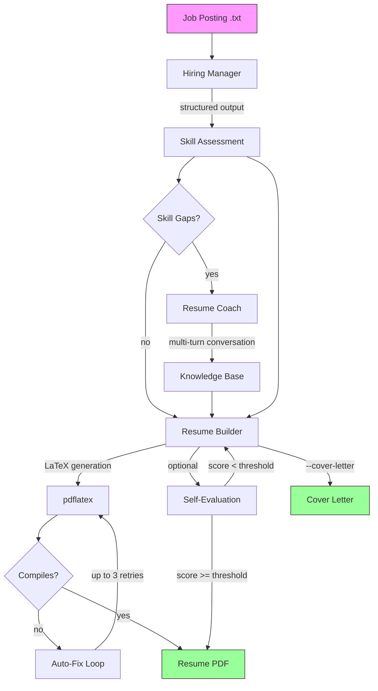

# Pipelines

An AI-powered resume builder CLI that analyzes job postings, identifies skill gaps, coaches you interactively, and generates tailored LaTeX resumes — all from your terminal.

## Architecture



### Module Overview

| Module | Purpose |
|--------|---------|
| `main.rs` | CLI entry point, pipeline orchestration |
| `llm.rs` | Provider-agnostic LLM client setup, `prompt_text` and `prompt_structured` helpers |
| `hiring_manager.rs` | Job posting analysis, candidate skill evaluation |
| `resume_coach.rs` | Interactive multi-turn coaching for skill gaps |
| `resume_builder.rs` | LaTeX resume generation with embedded templates and auto-fix loop |
| `eval.rs` | Self-evaluation loop (LLM-as-judge) |
| `kb.rs` | Knowledge base CRUD with embedding-based retrieval |
| `paths.rs` | XDG-compliant path resolution with env override |
| `cache.rs` | LLM response caching with TTL support |
| `stats.rs` | LLM usage tracking and cost observability |
| `ui.rs` | Terminal UI with spinners, colors, and styled output |
| `input.rs` | Interactive line/multiline input via rustyline |
| `prompts.rs` | All system prompts as constants |
| `bin/build_kb.rs` | Bootstrap KB from a resume (PDF, LaTeX, Markdown, or plain text) |
| `bin/fetch_job.rs` | Fetch and extract job postings from URLs |

### Design Decisions

- **Provider-agnostic**: All pipeline functions are generic over `M: CompletionModel + Clone`. Provider-specific logic (client construction, structured output strategy) is isolated in `llm.rs`. The `main.rs` match on `Provider` monomorphizes everything at the binary level.
- **Three-tier structured output**: OpenAI uses native `text.format` JSON schema, Gemini uses `generation_config`, and all other providers use prompt engineering with schema injection. A `strip_json_fences` helper handles models that wrap JSON in markdown code blocks.
- **NullEmbeddingModel**: Providers without embedding support use empty vectors. Cosine similarity returns 0.0 for empty vectors, preserving insertion order while including all stories.
- **Self-evaluation loop**: An LLM-as-judge scores the generated resume against the job posting. If below threshold (default 7/9), the resume is regenerated with feedback — up to 2 additional attempts.
- **Interactive coaching**: The resume coach uses multi-turn structured conversations to extract user stories for skill gaps, with follow-up and adjacent experience questions.
- **XDG data directories**: All persistent data (KB, cache, template overrides) lives in platform-standard directories (`~/Library/Application Support/pipelines/` on macOS, `~/.local/share/pipelines/` on Linux). Set `PIPELINES_DATA_DIR` to override for development.
- **Embedded templates**: LaTeX templates are compiled into the binary via `include_str!`. Users can override them by placing custom templates in the data directory.

## Setup

### Prerequisites

- Rust (edition 2024)
- `pdflatex` for PDF compilation (e.g. TeX Live, MacTeX)
- An API key for at least one supported LLM provider

### Supported Providers

| Provider | Env Var | Embeddings |
|----------|---------|------------|
| Claude | `ANTHROPIC_API_KEY` | No (NullEmbedding) |
| OpenAI | `OPENAI_API_KEY` | Yes (`text-embedding-3-small`) |
| Gemini | `GEMINI_API_KEY` | Yes (`text-embedding-004`) |
| DeepSeek | `DEEPSEEK_API_KEY` | No (NullEmbedding) |
| Groq | `GROQ_API_KEY` | No (NullEmbedding) |
| xAI | `XAI_API_KEY` | No (NullEmbedding) |
| Ollama | (local) | Optional (`all-minilm`) |

### Build

```bash
cargo build
```

## Usage

### 1. Bootstrap Knowledge Base

Before generating resumes you need to seed the knowledge base with your experience. `build_kb` accepts PDF, LaTeX, Markdown, or plain text resumes:

```bash
# From a PDF resume
cargo run --bin build_kb -- resume.pdf

# From a text/markdown resume
cargo run --bin build_kb -- resume.md

# Specify a custom output path
cargo run --bin build_kb -- resume.pdf /path/to/output.json
```

`build_kb` will:
1. Extract text from your resume (with PDF support via `pdf_oxide`)
2. Use the LLM to parse skills into the knowledge base
3. Use the LLM to extract your profile (name, contact, education, jobs)
4. Show the parsed profile for you to confirm, edit, or skip

### 2. Generate a Resume

```bash
# Using Claude (default)
cargo run -- job.txt

# Using a specific provider
cargo run -- --provider openai job.txt

# Local LLM via Ollama
cargo run -- --provider ollama --model llama3.2 job.txt

# Full options
cargo run -- \
  --provider claude \
  --out out/ \
  --cover-letter \
  --eval \
  --stats \
  --gap-threshold 3 \
  job.txt
```

### 3. Batch Mode

Pass a directory to process all `.md` job files recursively:

```bash
cargo run -- jobs/
```

Each job gets its own output subdirectory next to the source file.

### CLI Flags

| Flag | Description |
|------|-------------|
| `--provider` | LLM provider (`claude`, `open-ai`, `gemini`, `ollama`, `deep-seek`, `groq`, `xai`) |
| `--model` | Override the completion model name |
| `--embedding-model` | Override the embedding model name |
| `-o, --out` | Output directory for generated files |
| `--cover-letter` | Also generate a cover letter |
| `--eval` | Run self-evaluation loop on the generated resume |
| `--stats` | Print LLM usage statistics after completion |
| `--stream` | Stream LLM output for resume generation |
| `--gap-threshold` | Minimum skill gap to trigger coaching (default: 3) |
| `--related-skills` | Number of related KB stories to show during coaching (default: 1) |
| `--no-cache` | Disable LLM response caching |
| `--cache-ttl` | Cache TTL in seconds |
| `--trace` | Enable OpenTelemetry tracing |

## Environment Variables

### Provider selection

- `LLM_PROVIDER` — provider name (default: `claude`)
- `LLM_MODEL` — model name override
- `LLM_EMBEDDING_MODEL` — embedding model override

### Data directories

- `PIPELINES_DATA_DIR` — override all data/cache paths. When set, the KB lives at `$PIPELINES_DATA_DIR/user_skills.json` and cache at `$PIPELINES_DATA_DIR/cache/`. Useful for development:
  ```bash
  PIPELINES_DATA_DIR=./data cargo run -- job.txt
  ```

Without the override, data follows platform conventions:

| | macOS | Linux |
|---|---|---|
| Data | `~/Library/Application Support/pipelines/` | `~/.local/share/pipelines/` |
| Cache | `~/Library/Caches/pipelines/` | `~/.cache/pipelines/` |

### Other

- `OPENAI_BASE_URL` — override OpenAI API base URL
- `OLLAMA_API_BASE_URL` — override Ollama base URL (default: `localhost:11434`)
- `LLM_TIMEOUT_SECS` — request timeout (default: 120s)
- `LLM_CONNECT_TIMEOUT_SECS` — connection timeout (default: 10s)

## Template Customization

LaTeX templates for resumes and cover letters are embedded in the binary. To use custom templates, place them in the data directory:

```bash
# Find your data directory (printed at startup)
cargo run -- --help  # or check the "Data dir" line when running

# Copy and customize
cp data/resume_template.tex "$(pipelines_data_dir)/resume_template.tex"
cp data/cover_letter_template.tex "$(pipelines_data_dir)/cover_letter_template.tex"
```

The app checks the data directory first and falls back to the embedded templates.

## Testing

```bash
cargo test              # run all tests
cargo test -- <name>    # run specific test(s)
cargo clippy            # lint
```

## License

MIT
