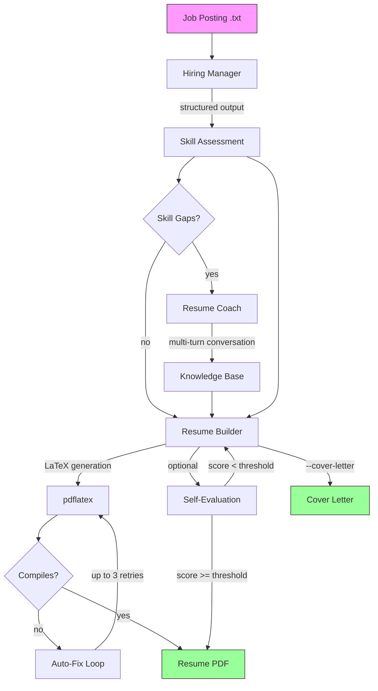

# Pipelines

An AI-powered resume builder CLI that analyzes job postings, identifies skill gaps, coaches you interactively, and generates tailored LaTeX resumes — all from your terminal.

## Architecture



### Module Overview

| Module | Purpose |
|--------|---------|
| `main.rs` | CLI entry point, pipeline orchestration |
| `llm.rs` | Provider-agnostic LLM client setup, `prompt_text` and `prompt_structured` helpers |
| `hiring_manager.rs` | Job posting analysis, candidate skill evaluation |
| `resume_coach.rs` | Interactive multi-turn coaching for skill gaps |
| `resume_builder.rs` | LaTeX resume generation with auto-fix loop |
| `eval.rs` | Self-evaluation loop (LLM-as-judge) |
| `kb.rs` | Knowledge base CRUD with embedding-based retrieval |
| `stats.rs` | LLM usage tracking and cost observability |
| `ui.rs` | Terminal UI with spinners, colors, and styled output |
| `prompts.rs` | All system prompts as constants |

### Design Decisions

- **Provider-agnostic**: All pipeline functions are generic over `M: CompletionModel + Clone`. Provider-specific logic (client construction, structured output strategy) is isolated in `llm.rs`. The `main.rs` match on `Provider` monomorphizes everything at the binary level.
- **Three-tier structured output**: OpenAI uses native `text.format` JSON schema, Gemini uses `generation_config`, and all other providers use prompt engineering with schema injection. A `strip_json_fences` helper handles models that wrap JSON in markdown code blocks.
- **NullEmbeddingModel**: Providers without embedding support use empty vectors. Cosine similarity returns 0.0 for empty vectors, preserving insertion order while including all stories.
- **Self-evaluation loop**: An LLM-as-judge scores the generated resume against the job posting. If below threshold (default 7/9), the resume is regenerated with feedback — up to 2 additional attempts.
- **Interactive coaching**: The resume coach uses multi-turn structured conversations to extract user stories for skill gaps, with follow-up and adjacent experience questions.

## Setup

### Prerequisites

- Rust (edition 2024)
- `pdflatex` for PDF compilation
- An API key for at least one supported LLM provider

### Supported Providers

| Provider | Env Var | Embeddings |
|----------|---------|------------|
| Claude | `ANTHROPIC_API_KEY` | No (NullEmbedding) |
| OpenAI | `OPENAI_API_KEY` | Yes (`text-embedding-3-small`) |
| Gemini | `GEMINI_API_KEY` | Yes (`text-embedding-004`) |
| DeepSeek | `DEEPSEEK_API_KEY` | No (NullEmbedding) |
| Groq | `GROQ_API_KEY` | No (NullEmbedding) |
| xAI | `XAI_API_KEY` | No (NullEmbedding) |
| Ollama | (local) | Optional (`all-minilm`) |

### Build

```bash
cargo build
```

## Usage

### Bootstrap Knowledge Base

First, parse your resume into the knowledge base:

```bash
cargo run --bin build_kb -- resume.txt
```

### Generate a Resume

```bash
# Using Claude (default)
ANTHROPIC_API_KEY=sk-... cargo run -- job.txt

# Using Gemini
LLM_PROVIDER=gemini GEMINI_API_KEY=... cargo run -- job.txt

# Full options
cargo run -- \
  --provider claude \
  --out out/ \
  --cover-letter \
  --eval \
  --stats \
  --gap-threshold 3 \
  job.txt
```

### CLI Flags

| Flag | Description |
|------|-------------|
| `--provider` | LLM provider (`claude`, `open-ai`, `gemini`, `ollama`, `deep-seek`, `groq`, `xai`) |
| `--model` | Override the completion model name |
| `--embedding-model` | Override the embedding model name |
| `-o, --out` | Output directory for generated files |
| `--cover-letter` | Also generate a cover letter |
| `--eval` | Run self-evaluation loop on the generated resume |
| `--stats` | Print LLM usage statistics after completion |
| `--gap-threshold` | Minimum skill gap to trigger coaching (default: 3) |

## Testing

```bash
cargo test              # run all tests
cargo test -- eval      # run eval module tests only
cargo test -- stats     # run stats module tests only
```

## License

MIT
